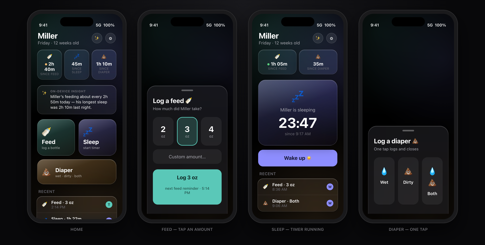
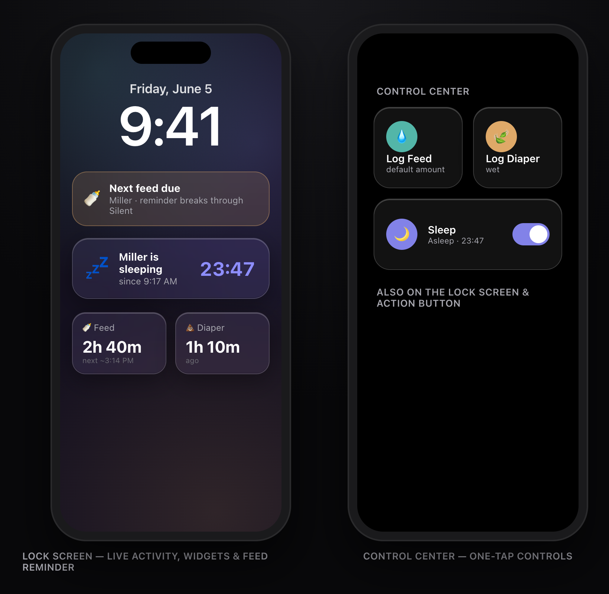
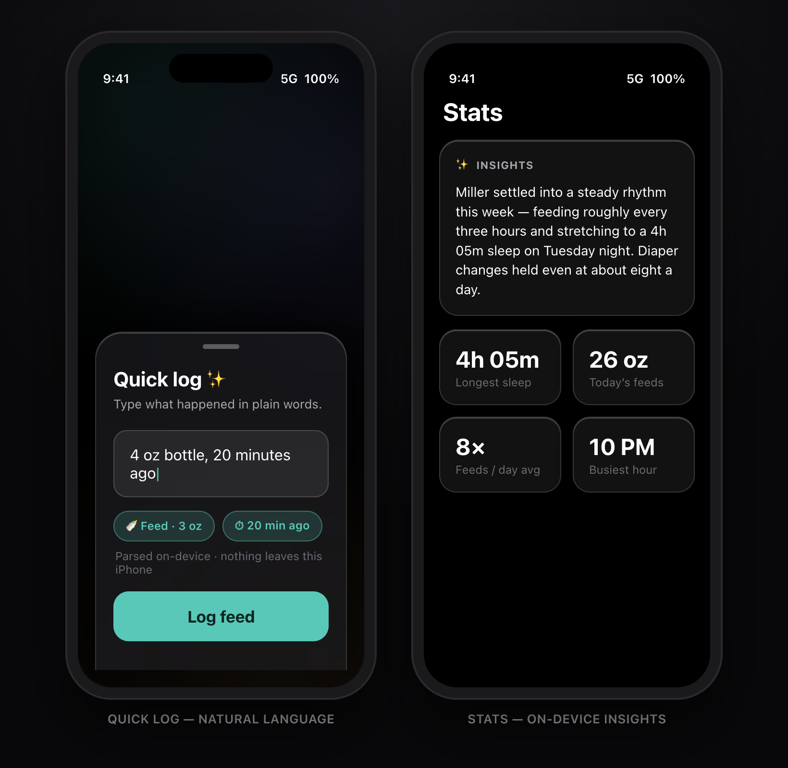
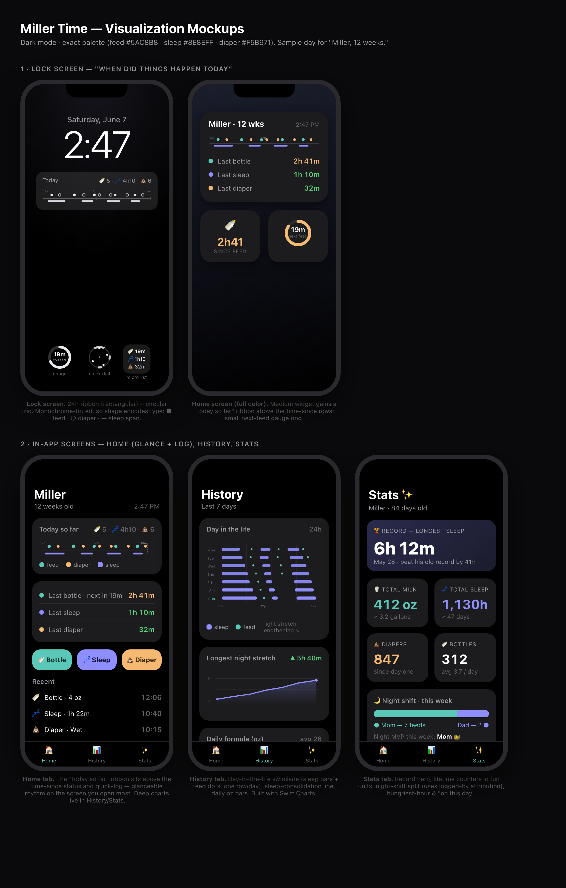

# Miller Time 🍼

A native iOS baby-tracking app for two parents to track their newborn — feeds,
sleep, and diaper changes — with real-time sync between both of their iPhones.
Built for speed of entry (you're holding a baby) and a calm, dark-mode-first
interface for 3 AM use. Distributed privately via TestFlight.

## Status

**In active development.** Core logging, the glanceable layer (widgets + Sleep
Live Activity), Siri/Shortcuts intents, and stats are implemented in SwiftUI with
local SwiftData persistence; CloudKit cross-parent sharing is wired up. The app now
targets **iOS 26** and adopts its headline frameworks — Liquid Glass, AlarmKit
feed reminders, on-device Foundation Models, and Control Center controls (see
[iOS 26 features](#ios-26-features)). No App Store submission — distributed via
TestFlight to the two parents.

## UI Preview

> The images below are dark-mode UI design mockups that reflect the implemented
> screens, updated for the iOS 26 look (Liquid Glass, on-device AI). Real device
> captures require building in Xcode on macOS.

**Core screens — Home · Feed · Sleep · Diaper** *(Liquid Glass cards, on-device insight strip, ✨ quick-log)*



**Glanceable layer — lock-screen Live Activity, widgets & feed reminder · Control Center controls**



**On-device AI — natural-language quick-log & Foundation Models insights**



**Insights — sleep/feed visualizations (Phase 3)**



## Features

- **Fast one-tap logging** — as few taps as possible:
  - **Feed** — log a bottle in ounces (configurable presets + custom amount)
  - **Sleep** — start/stop timer (the single running timer); shows live elapsed time
  - **Diaper** — wet / dirty / both, logged with one tap
- **Rolling timeline** — the last 12–24 hours of events (not a midnight "Today" reset)
- **Full edit + backdate** — fix the time, amount, type, or notes on any event
- **Urgency colors** — green → amber → red countdown to the next bottle at your
  target feed interval (default 3h, configurable)
- **Per-parent attribution** — each participant has a colored initial so you can
  see who logged what
- **Natural-language quick log** — tap ✨ and type "4 oz, 20 min ago" or "wet
  diaper"; parsed entirely on-device by Foundation Models (nothing leaves the phone)
- **On-device insights** — a short, warm plain-English recap of feeding cadence,
  longest sleep stretch, and busiest hour, generated locally on the Stats tab
- **Feed reminders** — an AlarmKit "next feed due" countdown that breaks through
  Silent and Focus, re-armed on every feed (device-local, opt-in)
- **Control Center / Action Button controls** — Log Feed, Log Diaper, and a
  stateful Sleep toggle available from Control Center, the Lock Screen, and the
  Action Button
- **History & stats** — review past events and emerging sleep/feed patterns
- **Real-time two-parent sync** — both phones see updates within ~10 seconds
- **Liquid Glass UI** — translucent cards and log tiles with a tab bar that
  minimizes on scroll (iOS 26)
- **Dark + Light appearance** — follows the iOS system setting
- **Accessibility** — Dynamic Type, VoiceOver labels, color-plus-label urgency,
  one-handed operation, silent (haptics + visuals, no sound)

## Tech Stack

- **SwiftUI** — declarative UI, iOS 26
- **SwiftData** — local persistence with automatic CloudKit sync
- **CloudKit** — real-time sync between both parents' iPhones (free for 2 users, no server)
- **WidgetKit** — lock screen and home screen widgets ("time since last feed")
- **ActivityKit / Live Activities** — live Sleep timer on the lock screen and Dynamic Island
- **App Intents / Siri & Controls** — "Hey Siri, log a diaper change" + Control Center / Action Button controls
- **AlarmKit** — "next feed due" reminder that breaks through Silent/Focus (iOS 26)
- **Foundation Models** — on-device natural-language logging & insights (iOS 26)
- **Swift Charts** — built-in charting for sleep/feed patterns

## iOS 26 features

The app targets iOS 26 and adopts four of its frameworks — each degrades
gracefully on hardware/OS that doesn't support it:

- **Liquid Glass** — `glassCard()` / `glassTile()` modifiers in
  `DesignSystem/Colors.swift` back the status pills, insight strip, log tiles, and
  Stats/History cards; the tab bar minimizes on scroll.
- **AlarmKit feed reminders** — `Alarms/FeedAlarmManager.swift` schedules a single
  "next feed due" countdown that pierces Silent/Focus. Device-local and opt-in
  (`LocalPrefs.feedReminderEnabled`), re-armed on each feed and on app foreground.
- **Foundation Models** — `AI/MillerIntelligence.swift` runs everything on-device:
  a warm Insights summary over `StatsEngine`, and `@Generable` natural-language
  parsing behind the ✨ quick-log sheet. Gated on model availability; UI hides when
  unavailable.
- **Controls** — `MillerTimeWidgets/LogControls.swift` exposes Log Feed, Log
  Diaper, and a stateful Sleep toggle to Control Center, the Lock Screen, and the
  Action Button, reusing the existing App Intents.

## Glanceable layer

- **Home-screen & lock-screen widgets** — time since the last feed/sleep/diaper at a glance
- **Sleep Live Activity** — a running timer on the lock screen and Dynamic Island while
  the baby is asleep (feeds are instantaneous, so there's no feed activity)
- **Siri App Intents** — log a feed or diaper, or toggle sleep, by voice

## Project structure

```
MillerTime/                 # Main iOS app target
├── App/                    # Entry point & routing (RootView, AppDelegate)
├── Models/                 # SwiftData models (Baby, FeedEvent, SleepEvent, DiaperEvent, Participant, …)
├── Store/                  # ModelContainer, EventStore, StatsEngine, seed data
├── DesignSystem/           # Colors + Liquid Glass, Urgency, Haptics, TimeFormatting, DayRibbon
├── Features/               # Home, Feed, Sleep, Diaper, Edit, History, Stats, Settings, Onboarding, Timeline
├── Intents/                # Siri App Intents (LogFeed, LogDiaper, ToggleSleep) + QuickLogger
├── AI/                     # MillerIntelligence — on-device Foundation Models (insights + NL logging)
├── Alarms/                 # FeedAlarmManager — AlarmKit "next feed due" reminder
├── LiveActivities/         # Sleep Live Activity (ActivityKit)
├── Sync/                   # CloudKit sync, sharing & join flows
└── Support/                # App Group, local prefs

MillerTimeWidgets/          # WidgetKit extension (small/medium/large widgets + ribbon,
                            #   Live Activity views, and Control Center controls)
docs/                       # Design & implementation documentation (see below)
mockups/                    # UI mockups (PNG + interactive index.html)
project.yml                 # XcodeGen project specification
```

## Building & running

The Xcode project is generated from `project.yml` with
[XcodeGen](https://github.com/yonaskolb/XcodeGen):

```sh
brew install xcodegen   # if needed
xcodegen generate
open MillerTime.xcodeproj
```

Then build & run on an iOS 26 simulator or device (Xcode 26 / iOS 26 SDK).
CloudKit sync requires a paid Apple Developer account and being signed in to iCloud
on the device. Foundation Models features (NL quick-log, Insights) require Apple
Intelligence–capable hardware and hide themselves where unavailable.

## Documentation

| Doc | What's in it |
|-----|--------------|
| [`docs/BUILD_PLAN.md`](docs/BUILD_PLAN.md) | Phased build roadmap, v1 scope, effort estimates |
| [`docs/DATA_MODEL.md`](docs/DATA_MODEL.md) | SwiftData schema, CloudKit layout, schema-evolution rules |
| [`docs/DESIGN.md`](docs/DESIGN.md) | Design system, screen states, accessibility |
| [`docs/IOS_VS_WEB_COMPARISON.md`](docs/IOS_VS_WEB_COMPARISON.md) | Why native iOS over a PWA (decision record) |
| [`docs/SIRI_AND_SHORTCUTS.md`](docs/SIRI_AND_SHORTCUTS.md) | Siri phrases, App Intents, Shortcuts & Control Center controls |
| [`docs/PRIVACY.md`](docs/PRIVACY.md) | Privacy model, data storage, access & roles |
| [`docs/VISUALIZATIONS.md`](docs/VISUALIZATIONS.md) | Future charts/stats design exploration |

## Roadmap

- **Phase 1 — Core logging** ✅ Feed/Sleep/Diaper, rolling timeline, edit/backdate,
  urgency colors, onboarding
- **Phase 2 — Live features & widgets** ✅ CloudKit sharing, home/lock-screen widgets,
  Sleep Live Activity
- **Phase 3 — Insights** ✅ sleep/feed charts and stats (Swift Charts)
- **Phase 4 — Smart features** ✅ Siri intents, Shortcuts, Control Center controls
- **iOS 26 adoption** ✅ Liquid Glass, AlarmKit feed reminders, on-device Foundation
  Models (NL logging + insights)
- **Next** — per-user push notifications; widget accented-rendering polish; AlarmKit
  "Log feed" alert action

See [`docs/BUILD_PLAN.md`](docs/BUILD_PLAN.md) for the full plan.
